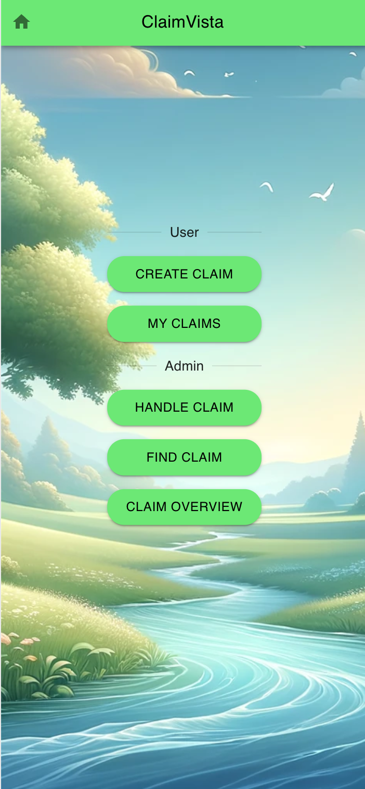

# ClaimVista for GCP


This application is run by an insurance company. It allows users to upload images of damages to their car, and will perform some analysis and help the user to fill out their claim. It will provide a description of the damages based on the image, as well as use the data from previous claims to help estimate the cost of repair. 

##  Prerequistes
1. Created a new MongoDB Atlas Project - name it claimvista-dev
For more info see: https://www.mongodb.com/docs/atlas/government/tutorial/create-project/

2. Created a new MongoDB Atlas database in the newly created Project
For more info see: https://www.mongodb.com/basics/create-database

3. Created an API Key inside that project, and recorded the public and private api keys,for more information see https://www.mongodb.com/docs/atlas/configure-api-access/#create-an-api-key-for-a-project IMPORTANT set permisssions to Project Owner

4.  Authenticate with Google cloud
https://cloud.google.com/sdk/docs/authorizing#init

5.  Activate the Bedrock anthropic.claude-3-sonnet in the Vertex AI

## Setup and Installation

There are 3 overall steps needed to get the demo up and running:

1. Load the initial dataset. This will take the included data set consisting of images of damaged vehicles, and use the gpt-4-vision model to describe them in english. We will also generate vector embeddings for each image description, and store all the data in MongoDB.
2. Deploy the app services resources.
3. Run the frontend


### Load the initial dataset

The scripts below can be run multiple times, they will skip images in the dataset for which they've already generated the appropriate description / embeddings.  

1. Set the appropriate environment variables: `ATLAS_USER`, `ATLAS_PASS`, `ATLAS_HOST`.

Setting environment variables

```bash
 export ATLAS_USER="admin"                                                             
 export ATLAS_PASS="password"                                                                   
 export ATLAS_HOST="claimvistadb.57kbl.mongodb.net" 

 
```
pip install --upgrade google-cloud-aiplatform
2. Run `pip install -r requirements.txt`. This will install python packages required.
3. Run `python describe_images_initial.py`. This will use the gpt-4-vision model to generate a json document for each image in the `./dataset` directory, describing the damage and severity. We'll also include the base64 encoded image, and load the document into MongoDB. Example document:


```json
{
  "title": "Vehicle Front-End Damage",
  "description": "The vehicle has sustained significant damage to the front bumper and headlight assembly. The headlight is broken, and there is visible deformation of the bumper with parts of the material separated and lying on the ground. The paint is scratched, and the body around the headlight is crumpled, indicating a forceful impact in this area.",
  "severity": "high",
  "image_path": "70.jpg",
  "image_base64": "<base64 encoded image>",
  "cost_estimate": 35750,
}
```

4. Run `generate_embeddings.py`. This will generate vector embeddings based on the damage description using text-embedding-ada-002, and add them to the existing documents in the database under the `embeddings` field. You should now have a collection named vechicle_damage in your Atlas Database.

5. Create the vector search index with Atlas Search using the following index definition, name it default:

```json
{
  "fields": [
    {
      "type": "vector",
      "path": "embedding",
      "numDimensions": 1536,
      "similarity": "euclidean"
    }
  ]
}
```
6. Create the full text search index with Atlas Search using the following index definition, name the index findClaim.

```json
{
  "mappings": {
    "dynamic": true,
    "fields": {
      "description": {
        "type": "string"
      }
    }
  }
}
```
### Deploy the app services resources
Follow the instructions in the folder frontend/README:md


